  

 

<table width="800" style="border:none;background:transparent;">
<tr>
<td width="50%" align="center" style="border:none;padding:8px;">
  <picture>
    <source media="(prefers-color-scheme: dark)"
      srcset="https://github-readme-stats.vercel.app/api?username=maryhug&show_icons=true&count_private=true&hide_border=true&title_color=f472aa&text_color=ffeaf4&icon_color=f472aa&bg_color=240d18&rank_icon=github"/>
    <source media="(prefers-color-scheme: light)"
      srcset="https://github-readme-stats.vercel.app/api?username=maryhug&show_icons=true&count_private=true&hide_border=true&title_color=d6336c&text_color=4a1030&icon_color=d6336c&bg_color=ffffff&rank_icon=github"/>
    
  </picture>
</td>
<td width="50%" align="center" style="border:none;padding:8px;">
  <picture>
    <source media="(prefers-color-scheme: dark)"
      srcset="https://github-readme-stats.vercel.app/api/top-langs/?username=maryhug&layout=compact&langs_count=6&hide_border=true&title_color=f472aa&text_color=ffeaf4&bg_color=240d18"/>
    <source media="(prefers-color-scheme: light)"
      srcset="https://github-readme-stats.vercel.app/api/top-langs/?username=maryhug&layout=compact&langs_count=6&hide_border=true&title_color=d6336c&text_color=4a1030&bg_color=ffffff"/>
    
  </picture>
</td>
</tr>
</table>

 

<picture>
  <source media="(prefers-color-scheme: dark)"
    srcset="https://github-readme-streak-stats.herokuapp.com/?user=maryhug&hide_border=true&background=240d18&ring=f472aa&fire=ffb7d5&currStreakNum=f472aa&currStreakLabel=e0a0c0&sideNums=ffeaf4&sideLabels=e0a0c0&dates=e0a0c0&stroke=7a2448"/>
  <source media="(prefers-color-scheme: light)"
    srcset="https://github-readme-streak-stats.herokuapp.com/?user=maryhug&hide_border=true&background=ffffff&ring=d6336c&fire=a8174a&currStreakNum=d6336c&currStreakLabel=9b5070&sideNums=4a1030&sideLabels=9b5070&dates=9b5070&stroke=f9c8de"/>
  
</picture>

